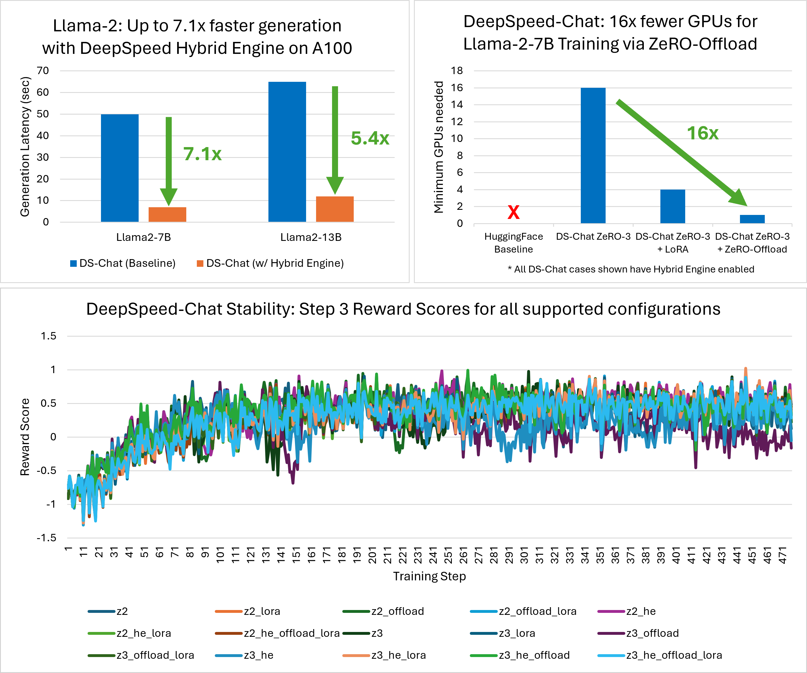
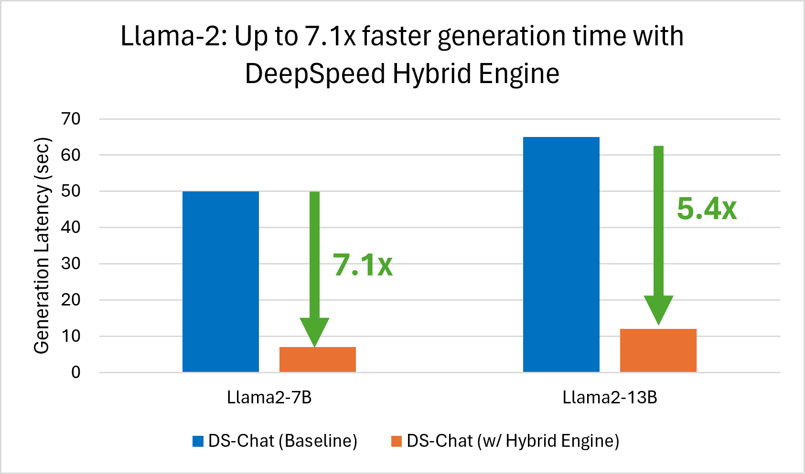
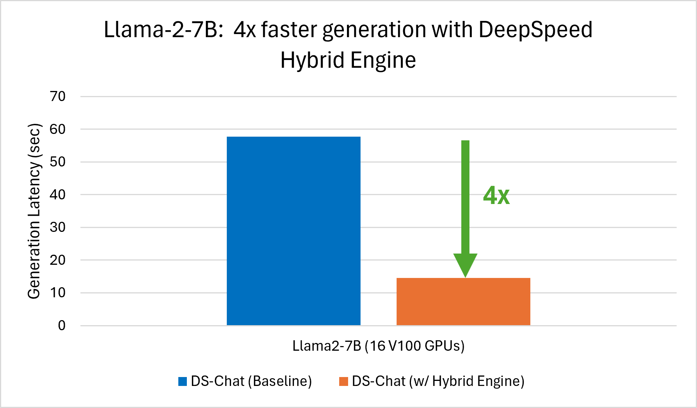
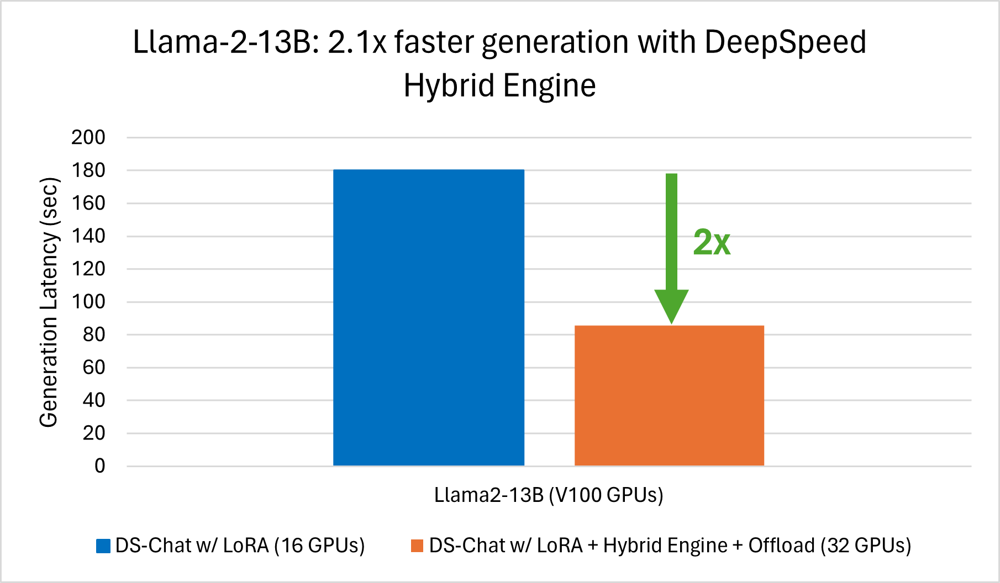
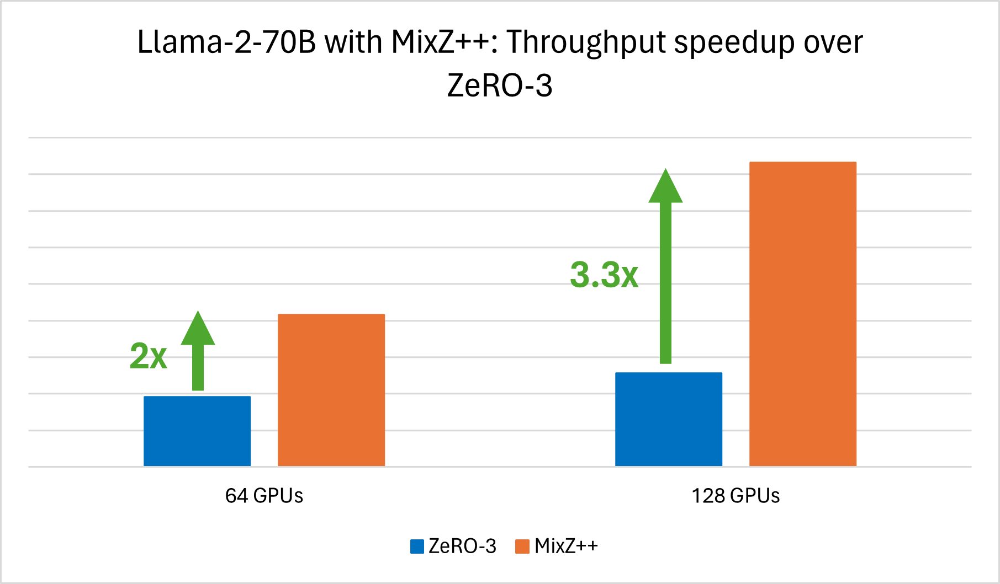
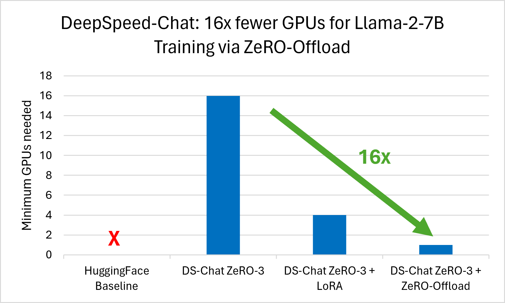
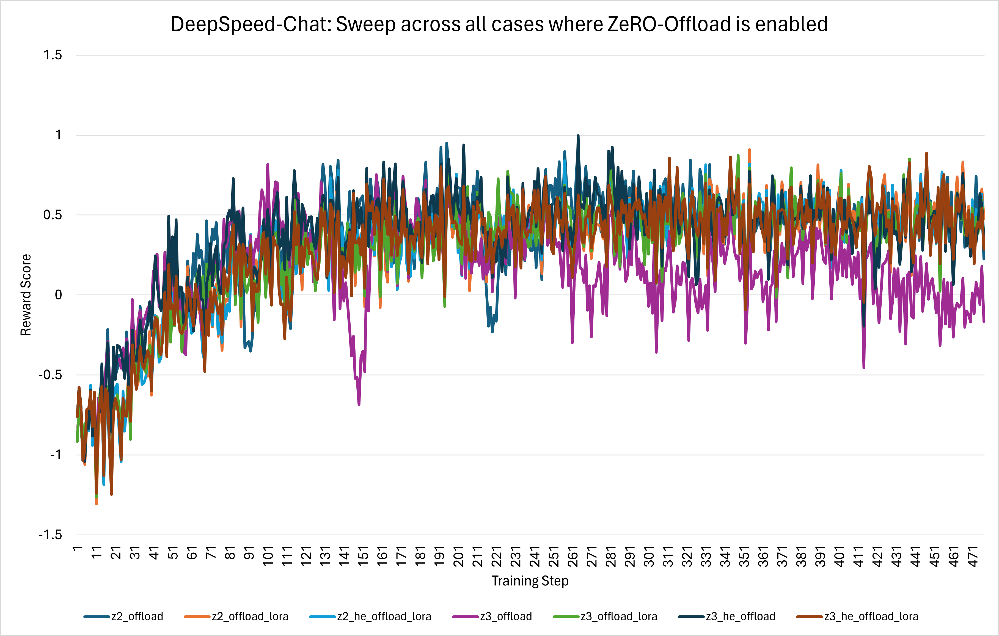
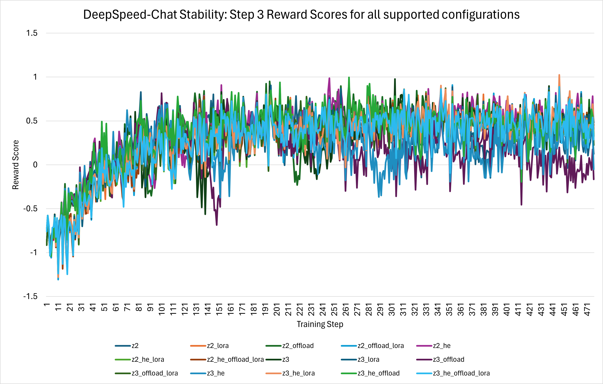
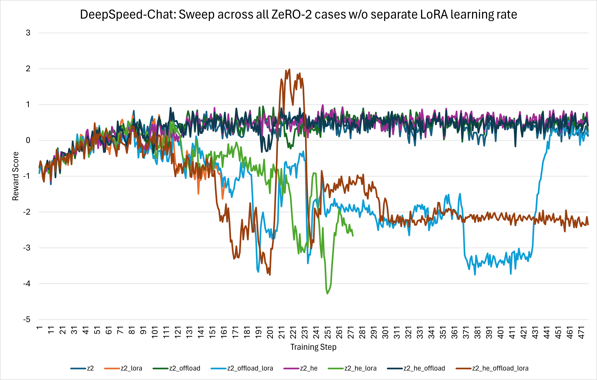
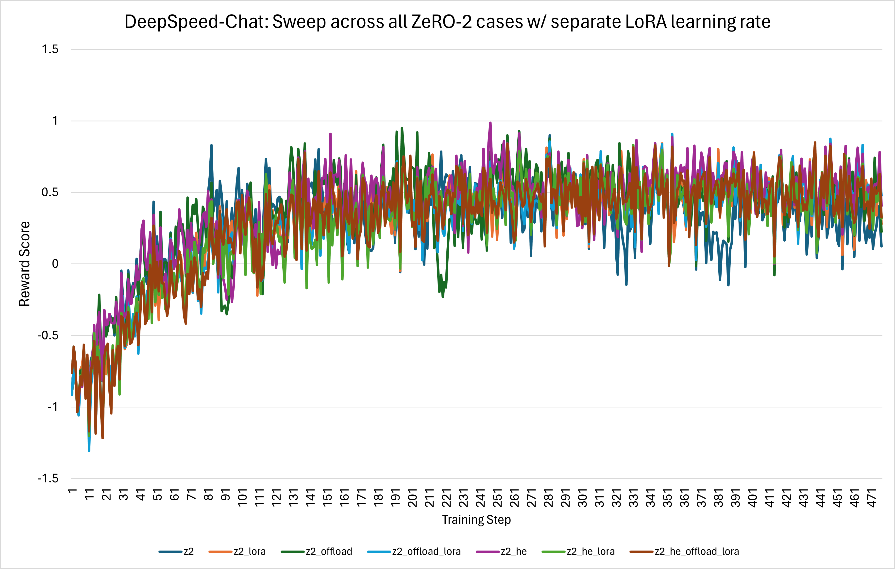

<div align="center">

# DeepScale-Chat: Llama/Llama-2 system support, efficiency boost, and training stability improvements

</div>

<div align="center">
  
</div>

# Table of Contents
1. [Introduction](#introduction)
2. [System Support for Llama and Llama-2 models](#system-support-llama)
3. [Improved Efficiency and Accessibility](#new-features)
    - [3.3x Higher Throughput with MixZ++ for LoRA](#mixz)
    - [ZeRO-Offload Support for Larger Models with 16x fewer GPUs](#zero-offload)
4. [Stability Bug Fixes](#stability-bug-fixes)
5. [Software Improvements](#software-improvements)
    - [Characterization Scripts](#characterization-scripts)
    - [Instrumentation](#instrumentation)
    - [Testing](#testing)
6. [Try Out DeepScale-Chat](#try-out-deepscale-chat)


# 1. Introduction <a name="introduction"></a>

DeepScale-Chat is a general system framework for RLHF training that enables easy, fast, affordable, and scalable training of ChatGPT-style models that we [publicly released on GitHub](https://github.com/khulnasoft/DeepScale/blob/master/blogs/deepscale-chat/README.md). The detailed performance and capabilities of DeepScale-Chat have been published in our [blog post](https://github.com/khulnasoft/DeepScale/tree/master/blogs/deepscale-chat) and [arXiv](https://arxiv.org/abs/2308.01320) paper.

We are happy to share that today we are improving DeepScale-Chat along three areas: i) system support for Llama/Llama-2 family of models, ii) system features for improved efficiency and accessibility, and iii) stability and software enhancements.

- **System support for training Llama and Llama-2 models**

  We ***introduce system support for training Llama and Llama-2 models*** in DeepScale-Chat enabling and leveraging various optimizations and features including the Hybrid Engine, ZeRO family of optimizations, Low-Rank Adaptation (LoRA) support, as well as full integration into the three-stage DeepScale-Chat RLHF pipeline. By leveraging the Hybrid-Engine, we speed up the experience generation phase for Llama-2-7B and Llama-2-13B models by **up to 7.1X**.

-  **New System Features for Improved Efficiency and Accessibility**
    - ***Mixed Precision ZeRO++ ([MixZ++](https://github.com/khulnasoft/DeepScale/pull/3954))***. It is an extended set of optimization strategies built upon [ZeRO++](https://www.deepscale.ai/tutorials/zeropp/) tailored to reduce memory usage and improve training/inference efficiency for RLHF training with LoRA. MixZ++ partitions model parameters across GPUs to reduce footprint and gathers them with quantized communication only when needed similar to its ZeRO and ZeRO++ siblings. Our evaluation indicates MixZ++ increases the training throughput by **up to 3.3x** for the Llama-2-70B model running on 128 V100 GPUs.

    - ***[ZeRO-Offload](https://www.microsoft.com/en-us/research/blog/zero-infinity-and-deepscale-unlocking-unprecedented-model-scale-for-deep-learning-training/)***. It is an optimization that offloads optimizer memory and computation from the GPU to the host CPU, enabling larger models to be trained with fewer GPU resources. After training stability fixes and testing, we have enabled this feature across all three stages of the DeepScale-Chat RLHF training pipeline. ZeRO-Offload reduces the minimum number of GPUs required to train large models by **up to 16x**.

- **Stability and Software Enhancements**

  - DeepScale-Chat contains a rich set of features for training across many different platforms and scenarios. Composing these features in a systematic way and ensuring both system stability and decent training convergence is critical for the usability of the framework. Thus, in addition to new features in DeepScale-Chat, many system stability and training convergence issues have been fixed both in DeepScale-Chat (client code) and DeepScale (runtime). These improvements have been thoroughly tested using the OPT model family for end-to-end training. Furthermore, end-to-end testing, characterization scripts, and several instrumentation features like TensorBoard support are now also available. *To try out these latest features and software improvements, please use DeepScale release [v0.10.2](https://github.com/khulnasoft/DeepScale/tree/v0.10.2) and the latest DeepScale-Chat in [DeepScaleExamples](https://github.com/khulnasoft/DeepScaleExamples)*.

  - Finally, to ensure the long-term health of the DeepScale-Chat training framework, [PyTests](https://github.com/khulnasoft/DeepScaleExamples/blob/master/applications/DeepScale-Chat/training/tests/test_training.py) were added for testing Step 3 of the RLHF training pipeline and are run on a nightly basis through a newly developed [GitHub Actions workflow](https://github.com/khulnasoft/DeepScale/actions/workflows/nv-ds-chat.yml).

We now dive into the details of our new features, training stability, and software improvements.

# 2. System Support for Llama and Llama-2 models <a name="system-support-llama"></a>

The DeepScale-Chat training framework now provides system support for the Llama and Llama-2 models across all three stages of training. To support this, we encountered a spectrum of issues, spanning from minor runtime errors to intricate performance-related challenges. In particular, the Llama model architecture which deviates from the standard Transformers block, was incompatible with DeepScale's inference kernels and the DeepScale container policy used by the Hybrid Engine. Addressing these hurdles necessitated extensive modifications across our DeepScale-Chat pipeline and the DeepScale runtime including code to support the ZeRO family of optimizations and their interaction with optimized inference kernels in the Hybrid Engine. We have resolved these challenges to ensure that DeepScale-Chat can support Llama and Llama-2 and provide our users with the best possible experience. The details can be seen from several PRs that have been merged in our codebases.

## Key Supported Optimizations

The following key optimizations in DeepScale are now fully integrated for Llama and Llama-2 models:

- **DeepScale-Chat Integration**: Fully integrated into the complete, end-to-end three-stage DeepScale-Chat RLHF training framework, based on the OpenAI InstructGPT training strategy.
- **Hybrid Engine**: DeepScale Hybrid Engine allows for superior generation phase [acceleration](https://github.com/khulnasoft/DeepScale/blob/master/blogs/deepscale-chat/README.md#throughput-and-model-size-scalability-comparisons-with-existing-rlhf-systems), now supported for all Llama-1 model variants, Llama-2-7B, and Llama-2-13B models.
- **ZeRO and ZeRO-Offload**: Fully supported by the [ZeRO](https://github.com/khulnasoft/DeepScale/blob/master/blogs/deepscale-chat/README.md#throughput-and-model-size-scalability-comparisons-with-existing-rlhf-systems) family of optimizations including offload support leveraging full memory capacity of a system thus enabling training of even larger models.
- **Mixed Precision ZeRO++ (MixZ++)**: Enhanced support for larger models like Llama-2-70B through the new MixZ++ feature, improving efficiency and reducing memory usage when there are frozen or non-trainable parameters.
- **LoRA**: Fully supported by the [LoRA](https://github.com/microsoft/LoRA) feature, which vastly reduces the storage requirements for large language models by freezing original weights and learning pairs of rank-decomposition matrices.

## Getting Started

Users looking to try the new Llama and Llama-2 model support can get started by using the newly added Llama scripts.
| Step Number | Scripts |
| --- | --- |
| 1 | [Llama-2 Step 1 Scripts](https://github.com/khulnasoft/DeepScaleExamples/tree/master/applications/DeepScale-Chat/training/step1_supervised_finetuning/training_scripts/llama2) |
| 2 | [Llama-2 Step 2 Scripts](https://github.com/khulnasoft/DeepScaleExamples/tree/master/applications/DeepScale-Chat/training/step2_reward_model_finetuning/training_scripts/llama2) |
| 3 | [Llama-2 Step 3 Scripts](https://github.com/khulnasoft/DeepScaleExamples/tree/master/applications/DeepScale-Chat/training/step3_rlhf_finetuning/training_scripts/llama2) |

*Note*: While all the system aspects of Llama and Llama-2 support have been extensively tested, there are no guarantees about training convergence and may require hyper-parameter tuning to achieve convergence.

## Performance Evaluation

We highlight the performance benefits of the Hybrid Engine for Llama-2 models on NVIDIA A100 and V100 GPUs in this section. Improved performance for larger models like Llama-2-70B and reduced resource requirements via ZeRO-Offload are discussed in the [next section](#new-features).

#### A100 Performance Evaluation
Using A100 GPUs, we achieve 7.1x faster generation for Llama-2-7B and 5.4x faster generation for Llama-2-13B with DeepScale-Chat Hybrid Engine compared to DeepScale-Chat without Hybrid Engine (baseline) as shown in *Figure 1*.


<div align="center">
  

  *Figure 1: Up to 7.1x faster Llama-2 generation with DS-Chat Hybrid Engine*

</div>

#### V100 Performance Evaluation
Using V100 GPUs, we achieve 4x faster generation for Llama-2-7B and 2.1x faster generation for Llama-2-13B with DeepScale-Chat Hybrid Engine compared to DeepScale-Chat without Hybrid Engine (baseline) as shown in *Figure 2*.

<div align="center">
  
  

  *Figure 2: [Left] 4x faster Llama-2-7B generation with DS-Chat Hybrid Engine (16 V100 GPUs) [Right] 2.1x faster Llama-2-13B generation with DS-Chat Hybrid Engine on 32 V100 GPUS vs. DS-Chat without Hybrid Engine on 16 V100 GPUs.*

</div>


# 3. Improved Efficiency and Accessibility <a name="new-features"></a>

We now dive into the details of two new features we are introducing today: 1) Mixed Precision ZeRO++ (MixZ++) and 2) ZeRO-Offload. Both these features offer unique benefits for DeepScale-Chat users. MixZ++ provides up to 3.3x better throughput for LoRA-enabled training and ZeRO-Offload reduces the minimum number of GPUs required to train by up to 16x.

## 3.3x Higher Throughput with MixZ++ for LoRA <a name="mixz"></a>

Mixed Precision ZeRO++ ([MixZ++](https://github.com/khulnasoft/DeepScale/pull/3954)) is an extended set of optimization strategies built upon [ZeRO](https://www.deepscale.ai/tutorials/zero/) and [ZeRO++](https://www.deepscale.ai/tutorials/zeropp/) tailored to reduce memory usage and improve training/inference efficiency for RLHF training with LoRA.

Similar to [ZeRO](https://www.deepscale.ai/tutorials/zero/), MixZ++ partitions model parameters across GPUs to reduce footprint and gathers them only when needed. In addition, similar to ZeRO++, MixZ++ allows for hierarchical partitioning and quantized communication. The hierarchical partitioning allows all the parameters to be stored within a node when possible so that the communication happens within a node, where communication bandwidth is significantly higher than communicating across nodes. The communication overhead is further reduced by quantizing the weights before gathering them.

Finally, unlike ZeRO++ where parameters are always stored in fp16/bf16, and quantized/dequantized before and after communication, MixZ++ can persistently store the frozen weights in [Low-Rank Adaptation (LoRA)](https://github.com/microsoft/LoRA) in lower-precision, significantly reducing the communication overhead, eliminating quantization overhead, and supporting larger batch sizes that enable better efficiency.

A comprehensive exploration of technical details can be accessed through our [ZeRO++ blog](https://www.microsoft.com/en-us/research/blog/deepscale-zero-a-leap-in-speed-for-llm-and-chat-model-training-with-4x-less-communication/), [MixZ++ tutorial](https://www.deepscale.ai/tutorials/mixed_precision_zeropp/), and [paper](https://arxiv.org/pdf/2306.10209.pdf).

#### Highlights

State-of-the-art approaches like [QLoRA](https://arxiv.org/abs/2305.14314) focus on combining multiple techniques like quantization of LoRA weights, relying on new datatypes such as NF4, and memory-management/offload techniques like paged optimizers to enable finetuning of large models on a single GPU. MixZ++ is our approach to enable large model training powered by quantization but is designed to scale to a large number of GPUs with simplicity and compatibility with existing technologies like ZeRO-Offload and DeepScale Hybrid Engine.

MixZ++ has the following highlights:
- Simplicity: A general solution requiring no assumptions about the model and/or optimizer. Integrating it into your training script is as simple as adding a single line of code.
- Performance: Powered by a set of highly optimized CUDA kernels that enables efficient quantization/dequantization. The evaluation shows up to 3.3x higher throughput for Llama-2-70B training on 128 GPUs compared to the ZeRO-3 baseline (*Figure 3*).
- Compatibility: Compatible with DeepScale/ZeRO features like DeepScale Hybrid Engine, ZeRO-Offload, etc.
- Scalability: Designed to scale to a large number of GPUs. It is tested on up to 384 GPUs on Azure.


#### Performance Evaluation
To assess the effectiveness of MixZ++ for LoRA-enabled training, we carried out a series of RLHF training experiments (Step 3) using the Llama-2-70B model. These experiments were conducted on hardware configurations featuring 64 and 128 V100 GPUs. A visual representation of the experiment results is shown in the following figure:

<div align="center">
  

  *Figure 3: We achieve 3.3x increased throughput for RLHF training of Llama-2-70B on 128 V100 GPUs using Mixed Precision ZeRO++ vs. ZeRO-3. We obsvered 2x improved throughout for the same experiment on 64 V100 GPUs.*

</div>

Specifically, our results showcase a 2x increase in training throughput when utilizing 64 GPUs with MixZ++, compared to the ZeRO-3 baseline. Furthermore, when scaling up to 128 GPUs, the speedup effect becomes even more pronounced, with a substantial 3.3x improvement in training throughput. These outcomes underscore the potential of MixZ++ as a powerful tool for improving training efficiency in large-scale GPU settings.

To try this feature, please refer to [MixZ++ tutorial](https://www.deepscale.ai/tutorials/mixed_precision_zeropp/).

## ZeRO-Offload Support for Larger Models with 16x fewer GPUs <a name="zero-offload"></a>

[ZeRO-Offload](https://www.microsoft.com/en-us/research/blog/zero-infinity-and-deepscale-unlocking-unprecedented-model-scale-for-deep-learning-training/) powers unprecedented model sizes by leveraging the full memory capacity of a system, concurrently exploiting all heterogeneous memory. Modern GPU clusters have 2-3x more CPU memory than GPU memory. ZeRO-Offload capitalizes on this disparity and offloads optimizer memory and computation from the GPU to the host CPU, enabling larger models to be trained with fewer GPU resources without being bottlenecked by the CPU's lower bandwidth. ZeRO-Offload allows training of large models on up to 16x fewer GPUs as we can see in *Figure 4*.

<div align="center">
  

  *Figure 4: ZeRO-Offload enables us to train Llama-2-7B with 16x fewer GPUs. 16 V100 GPUs are required for training Llama-2-7B with DS-Chat ZeRO-3. Enabling LoRA allows for the number of GPUs to be reduced to 4 while enabling ZeRO-Offload reduces the number of needed GPUs to 1. The HuggingFace Baseline does not run due to memory limitations.*

</div>

ZeRO-Offload was [disabled](https://github.com/khulnasoft/DeepScaleExamples/pull/553)
 with the initial release of DeepScale-Chat due to training instability that was observed when it was used with Hybrid Engine and LoRA. After improvements to Hybrid Engine and LoRA as well as extensive testing of all feature configurations for ZeRO Stage2 and ZeRO Stage 3, this feature can now be enabled across all three steps of the DeepScale-Chat training framework. Please note that configuring ZeRO-Offload with ZeRO Stage 2 and Hybrid Engine with LoRA disabled is currently unsupported due to observed training instability.

<div align="center">
  

  *Figure 5: Reward scores for all supported DeepScale-Chat configurations with ZeRO-Offload enabled. Run with 16 V100 GPUs, [AdamG012/chat-opt-1.3b-sft-deepscale](https://huggingface.co/AdamG012/chat-opt-1.3b-sft-deepscale) actor model, [AdamG012/chat-opt-350m-reward-deepscale](https://huggingface.co/AdamG012/chat-opt-350m-reward-deepscale) critic model, DS commit: [f036f00c](https://github.com/khulnasoft/DeepScale/tree/f036f00c3763694e539a9070a98130e2667e49bd), DSE commit: [81a8521f](https://github.com/khulnasoft/DeepScaleExamples/tree/81a8521f05e2761eed34fcf65f19873df9f74403).*

</div>

# 4. Stability Bug Fixes <a name="stability-bug-fixes"></a>

A wide range of issues have been addressed in the DeepScale runtime and the DeepScale-Chat pipeline. These fixes enable advanced features such as Hybrid Engine, LoRA, and ZeRO-Offload to run across all training steps of the DeepScale-Chat pipeline and improve training stability and convergence.

<div align="center">
  

  *Figure 6: Step 3 Reward Scores for all supported DeepScale-Chat configurations. Run with 16 V100 GPUs, [AdamG012/chat-opt-1.3b-sft-deepscale](https://huggingface.co/AdamG012/chat-opt-1.3b-sft-deepscale) actor model, [AdamG012/chat-opt-350m-reward-deepscale](https://huggingface.co/AdamG012/chat-opt-350m-reward-deepscale) critic model, DS commit: [f036f00c](https://github.com/khulnasoft/DeepScale/tree/f036f00c3763694e539a9070a98130e2667e49bd), DSE commit: [81a8521f](https://github.com/khulnasoft/DeepScaleExamples/tree/81a8521f05e2761eed34fcf65f19873df9f74403).*

</div>

*Figure 6* above shows the training convergence across all supported DeepScale-Chat configurations. This data was collected using 16 V100 NVIDIA GPUs, the [AdamG012/chat-opt-1.3b-sft-deepscale](https://huggingface.co/AdamG012/chat-opt-1.3b-sft-deepscale) OPT model as the actor, the [AdamG012/chat-opt-350m-reward-deepscale](https://huggingface.co/AdamG012/chat-opt-350m-reward-deepscale) OPT model as the critic, and the following DeepScale and DeepScaleExamples repository commits: DS commit: [f036f00c](https://github.com/khulnasoft/DeepScale/tree/f036f00c3763694e539a9070a98130e2667e49bd), DSE commit: [81a8521f](https://github.com/khulnasoft/DeepScaleExamples/tree/81a8521f05e2761eed34fcf65f19873df9f74403).

We now dive into the details of all the fixes across different areas.

## DeepScale-Chat Pipeline Fixes

In this section we discuss the functionality and training stability fixes in the DeepScale-Chat pipeline.

- **Training Stability:**

  - [PR #620 - Make training more stable](https://github.com/khulnasoft/DeepScaleExamples/pull/620)

    - To improve the training stability in Step 3, several different areas of training were tuned and changed. To start, the Kullback-Liebler (KL) divergence used in the Proximal Policy Optimization (PPO) trainer was slightly tuned to reduce divergence between the new and reference policies and improve the reward score. Next, the sequence generation function in the PPO trainer (`_generate_sequence()`) removed the specification of a `min_length` in the Actor model's `generate()` call, which means generated sequences won't be artificially enlarged, allowing for the possibility of sequence generation to collapse i.e. when training convergence is extremely poor. A minor off-by-one error was also fixed in the PPO trainer's reward computation function (`compute_rewards()`). Finally, the PPO trainer's RLHF training function was updated to zero out the reward and value after the end of a conversation to prevent incorrect `advantages` and `returns`.

  - [PR #633 - DS Chat Step 3 - Add separate Lora Adam optimizer group](https://github.com/khulnasoft/DeepScaleExamples/pull/633)

    - The [LoRA](https://github.com/microsoft/LoRA) feature is supported across all three training steps of the DeepScale-Chat framework. Prior to this stability effort, there was no distinction between the overall learning rate and the LoRA learning rate i.e. the LoRA learning rate was set to whatever the overall learning rate was. This led to instability in training convergence and can be seen in *Figure 7* below showing the reward score across training steps for various Step 3 configurations:

      <div align="center">
        

        *Figure 7: Before the fix, the sweep across all ZeRO-2 cases without a separate LoRA learning rate shows training instability when LoRA is used.*

      </div>

      To address this training convergence issue, when creating the optimizer grouped parameters, the LoRA `lora_right_weight` and `lora_left_weight` parameters were explicitly separated out and given their own LoRA-specific learning rate. After this change, a dramatic improvement in stability was observed, as shown in the figure below:

      <div align="center">
        

        *Figure 8: After creating a separate LoRA learning rate, the sweep across all ZeRO-2 cases shows proper convergence.*

      </div>

      The next fix details the addition of separate LoRA learning rate arguments.

  - [PR ##685 Add LoRA LR for DS Chat steps 1-3](https://github.com/khulnasoft/DeepScaleExamples/pull/685)

    - A *separate* LoRA learning rate argument can now be provided in each of the three training steps, with Step 3 having individual LoRA learning rates for the Actor and Critic models.

- **Bug Fixes:**

  - [PR #636 - DS Chat Step 3 - Fix Zero Stage 3](https://github.com/khulnasoft/DeepScaleExamples/pull/636)

      - During DeepScale-Chat Step 3 training, we observed hangs when ZeRO Stage 3 was enabled for the actor model and when the `world_size > 1`. When observing the state of each rank, one rank would still be in the sequence generation phase `self._generate_sequence()`, while the other rank had already progressed to the `self.actor_model()` call. This ZeRO Stage 3 desynchronization, due to misaligned token generation between the GPUs, can normally be automatically detected and accounted for in the HuggingFace Transformers library via `synced_gpus`. However, due to the nature of the DeepScale-Chat pipeline and the lifetime of the corresponding model configuration objects, this automatic detection code was not triggered. To resolve this, when invoking the `generate()` function, the `synced_gpus` argument is explicitly passed and set to `True` when ZeRO Stage 3 is being used.

  - [PR #658 - Fix only optimize lora and ack-ckpting compatible](https://github.com/khulnasoft/DeepScaleExamples/pull/658)

    - This fix allows Step 3 training to run with the combination of gradient checkpointing and *LoRA-only* parameter optimization, a previously unsupported training case. With the addition of the [enable_input_require_grads](https://github.com/huggingface/transformers/blob/f26099e7b5cf579f99a42bab6ddd371bf2c8d548/src/transformers/modeling_utils.py#L1225) model utility function in the HuggingFace Transformers library, which enables the gradients for the input embeddings, gradient checkpointing and optimization of *only* the LoRA parameters is made possible.

  - [PR #576 - Fix argparse](https://github.com/khulnasoft/DeepScaleExamples/pull/576)

    - An external contributor helped in resolving an argument parsing issue.

  - [PR #584 - Fix unused parameter bug](https://github.com/khulnasoft/DeepScaleExamples/pull/584)

    - An external contributor fixed the passing of an uninitialized parameter that was hardcoded earlier.


## Hybrid Engine Fixes
In this section we discuss several fixes in the Hybrid Engine.

- [PR #3563 - Fix LoRA Fuse/Unfuse in Hybrid Engine](https://github.com/khulnasoft/DeepScale/pull/3563)

  - During Step 3 training for OPT with LoRA and Hybrid Engine enabled, an issue arose regarding a tensor size mismatch of the LoRA weights. Specifically, the LoRA QKV weights were not fused in the OPT container policy, yet they were expected to be fused by the Hybrid Engine. This challenge was effectively resolved by introducing both fused and unfused LoRA methods in the Hybrid Engine. We thank @sxjscience for providing this fix.

- [PR #3883 - Extend HE-Lora test with Z3 support + Fix/add guard in HE for Z3](https://github.com/khulnasoft/DeepScale/pull/3883)

  - The Hybrid Engine was updated to properly check whether ZeRO Stage 3 was enabled when resetting the inference container parameters, along with expanding the corresponding unit tests.


## ZeRO Stage 3 Fixes
In this section we discuss several fixes in support of the ZeRO Stage 3 feature.

- [PR #3819 - Fix racing condition in GatheredParameters](https://github.com/khulnasoft/DeepScale/pull/3819)

  - A race condition in the the ZeRO `GatheredParameters` context, which resulted in various `'status': 'INFLIGHT'` issues, was fixed by removing duplicate input parameters that were being passed from the Hybrid Engine.

- [PR #3884 - Separate ZeRO3 InflightParamRegistry for train and eval](https://github.com/khulnasoft/DeepScale/pull/3884)

  - The ZeRO Stage 3 `InflightParamRegistry` was updated to use a separate `InflightParamRegistry` for training and evaluation, fixing an issue where leftover parameters in flight were causing inflight parameter errors. These fixes, along with related fixes in the Hybrid Engine, enabled the use of the ZeRO-Offload feature in the DeepScale-Chat training pipeline.

- [PR #3928 - Remove the param.ds_tensor from print](https://github.com/khulnasoft/DeepScale/pull/3928)

  - A minor change that was necessary to address the DeepScale-Chat Step 3 hang issue ([PR #636](https://github.com/khulnasoft/DeepScaleExamples/pull/636)) as it allowed us to progress further into execution and observe the desynchronization point.


# 5. Software Improvements <a name="software-improvements"></a>

To improve the characterization, ease of debug, and maintainability of the DeepScale-Chat framework, several areas of software improvements have been completed. Characterization scripts were added to enable systematic composition of features, instrumentation was added to improve insight into the behavior of training, and a testing CI workflow was added to improve the maintainability of the DeepScale-Chat training framework.

## Characterization Scripts

The DeepScale-Chat training framework provides a rich set of features (Hybrid Engine, ZeRO, LoRA, etc.) that can be composed in many different combinations, depending on the scenario. The interactions between the features are often complex and composing them in a systematic way for characterization is useful for understanding their behavior. To support such use cases, characterization scripts have been added to run sweeps of Steps 1, 2, and 3 training for various combinations of features. The scripts default to OPT but can be modified to run with Llama. Please see the READMEs in the following folders for more details:

- [Step 1 Sweep Scripts](https://github.com/khulnasoft/DeepScaleExamples/tree/master/applications/DeepScale-Chat/training/step1_supervised_finetuning/training_scripts/opt/single_node/sweep)
- [Step 2 Sweep Scripts](https://github.com/khulnasoft/DeepScaleExamples/tree/master/applications/DeepScale-Chat/training/step2_reward_model_finetuning/training_scripts/opt/single_node/sweep)
- [Step 3 Sweep Scripts](https://github.com/khulnasoft/DeepScaleExamples/tree/master/applications/DeepScale-Chat/training/step3_rlhf_finetuning/training_scripts/opt/single_node/sweep)

For example, the Step 3 characterization script sweeps across various training features:
| Feature | Values |
| --- | --- |
| ZeRO Stage | 2, 3 |
| Hybrid Engine | True, False |
| ZeRO-Offload | True, False |
| LoRA | True, False |

And can be ran as follows:

<pre>
DeepScaleExamples/applications/DeepScale-Chat/training/step3_rlhf_finetuning$ bash training_scripts/opt/single_node/sweep/run_step3_sweep.sh
</pre>

The training log for each combination of features will be stored in a folder with the name formatted as `z${z}_he_${he}_offload_${offload}_lora_${lora}`


Related PRs:

- [DS Chat Characterization Scripts (Step 1 and 3)](https://github.com/khulnasoft/DeepScaleExamples/pull/638)
- [Add step 2 sweep script, clean up scripts](https://github.com/khulnasoft/DeepScaleExamples/pull/664)
- [Update script location and docs for all 3 steps](https://github.com/khulnasoft/DeepScaleExamples/pull/681)

## Instrumentation

To gain better insight into DeepScale-Chat training, new [instrumentation features](https://github.com/khulnasoft/DeepScaleExamples/pull/624) were added across all three steps of DeepScale-Chat and can be enabled via arguments to each step's `main.py`.

| Argument | Description | Step(s) |
| --- | --- | --- |
| --print_loss         | Print loss during each step                                                     | 1     |
| --enable_tensorboard | Enable TensorBoard logging at the model Runtime Engine level                    | 1,2,3 |
|                      | Enable TensorBoard logging at the Training Pipeline level                       | 3     |
| --tensorboard_path   | Path to write TensorBoard log                                                   | 1,2,3 |
| --print_answers      | Print actor model prompt and answers during training across all ranks           | 3     |


### TensorBoard
TensorBoard logging can be enabled in each of the three training steps, with some slight nuances in Step 3. To start, for each training step, the `enable_tensorboard` argument can be used to enable a TensorBoard monitor at the Runtime Engine level ([see documentation](https://www.deepscale.ai/docs/config-json/#monitoring-module-tensorboard-wandb-csv)) and is reflected in the corresponding model training configuration:
```python
"tensorboard": {
    "enabled": enable_tensorboard,
    "output_path": f"{tb_path}/ds_tensorboard_logs/",
    "job_name": f"{tb_name}_tensorboard"
}
```

- **Step 3**:
    Due to Step 3 initializing both an Actor and a Critic model, _each_ of the models will have their own corresponding TensorBoard monitor at the Runtime Engine level. Beyond that, Step 3 training also contains a Pipeline-level TensorBoard monitor a level above the model runtime engines, which captures the `reward`, `actor_loss`, `actor_loss_sum`, `critic_loss`, and `critic_loss_sum`.

## Testing

As part of the DeepScale team's commitment to maintaining the DeepScale-Chat training framework, continuous integration [PyTest](https://github.com/khulnasoft/DeepScaleExamples/blob/master/applications/DeepScale-Chat/training/tests/test_training.py) testing has been added for Step 3 RLHF training in a new [GitHub Actions workflow](https://github.com/khulnasoft/DeepScale/actions/workflows/nv-ds-chat.yml).

| Description | Status |
| ----------- | ------ |
| Integrations | [](https://github.com/khulnasoft/DeepScale/actions/workflows/nv-ds-chat.yml) |

 The workflow is run on a **nightly** basis across a **16-case** test matrix (see table below), and uses the **facebook/opt-125m** model for both the actor and critic.

| Parameter | Values |
| --- | --- |
| ZeRO Stage    | 2, 3        |
| Hybrid Engine | True, False |
| ZeRO-Offload  | True, False |
| LoRA          | True, False |

Each configuration (16 total) runs through a limited number of Step 3 non-overflow training steps (i.e. steps where neither actor nor critic overflow) and saves the actor/critic models. Assertions are used to check if the training pipeline executed correctly and if the actor and critic models were saved properly.

# 6. Try Out DeepScale-Chat <a name="try-out-deepscale-chat"></a>
We are very excited to share this DeepScale-Chat feature and stability release.

* To get started, please visit our GitHub page for DeepScale-Chat: [GitHub Landing Page](https://github.com/khulnasoft/DeepScaleExamples/tree/master/applications/DeepScale-Chat)

* We will continue to improve DeepScale-Chat with your feedback and support. Our [roadmap](https://github.com/khulnasoft/DeepScaleExamples/tree/master/applications/DeepScale-Chat/README.md#-deepscale-chats-roadmap-) shows currently supported features as well as ones that are planned for future.

DeepScale-Chat is part of the bigger DeepScale ecosystem comprising of a multitude of Deep Learning systems and modeling technologies. To learn more,

* Please visit our [website](https://www.deepscale.ai/) for detailed blog posts, tutorials, and helpful documentation.
* You can also follow us on our [English Twitter](https://twitter.com/MSFTDeepScale), [Japanese Twitter](https://twitter.com/MSFTDeepScaleJP), and [Chinese Zhihu](https://www.zhihu.com/people/deepscale) for latest news on DeepScale.

DeepScale welcomes your contributions! We encourage you to report issues, contribute PRs, and join discussions on the [DeepScale GitHub](https://github.com/khulnasoft/DeepScale/) page. Please see our [contributing guide](https://github.com/khulnasoft/DeepScale/blob/master/CONTRIBUTING.md) for more details. We are open to collaborations with universities, research labs, companies, such as those working together on deep learning research, applying DeepScale to empower real-world AI models and applications, and so on. For such requests (and other requests unsuitable for GitHub), please directly email to deepscale-info@microsoft.com.

* "Star" our [DeepScale GitHub](https://github.com/khulnasoft/DeepScale/) and [DeepScaleExamples GitHub](https://github.com/khulnasoft/DeepScaleExamples/) repositories if you like our work!
